# Expe 💼 - Expense Reimbursement System

A comprehensive, production-ready expense management system with multi-level approval workflows, OCR receipt scanning, and conditional approval rules.


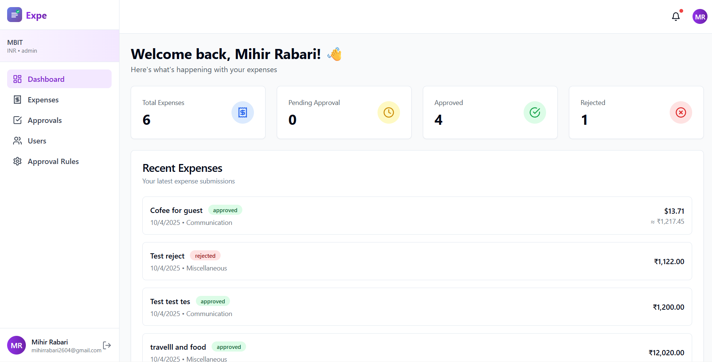
## ✨ Features

### 🔐 Authentication & User Management
- Auto-create company and admin on first signup
- JWT-based authentication
- Role-based access control (Admin, Manager, Employee)
- Password reset functionality
- Email notifications with beautiful templates

### 💰 Expense Management
- Submit expenses in any currency
- Real-time currency conversion
- OCR receipt scanning (auto-extract expense details)
- Multiple expense categories
- Draft, submit, and track expenses
- Comprehensive expense history

### ✅ Multi-Level Approval Workflows
- Sequential approval chains (Manager → Finance → Director)
- Percentage-based approval rules (e.g., 60% must approve)
- Specific approver bypass (e.g., CFO auto-approves)
- Hybrid rules (combine sequential + conditional)
- Manager approval routing
- Approval history tracking

### 🌍 Multi-Currency Support
- 150+ countries and currencies
- Real-time exchange rate conversion
- Display in both original and company currency

### 📧 Email Notifications
- 7 beautiful, responsive email templates
- Welcome emails with credentials
- Expense submission confirmations
- Approval request notifications
- Approval/rejection notifications
- Password reset emails

### 📊 Monitoring & Analytics
- Prometheus metrics integration
- Grafana dashboards
- Real-time performance monitoring
- Custom business metrics

## 🧭 System Architecture

```mermaid
flowchart LR
  subgraph Frontend [React (Vite)]
    UI[UI: Tailwind + Components]
    APIClient[Axios]
  end

  subgraph Backend [Node.js Express API]
    Auth[JWT Auth]
    OCR[OCR Service]
    Rules[Approval Rules]
    Metrics[Prometheus Metrics]
  end

  subgraph Infra [Infrastructure]
    DB[(PostgreSQL)]
    Cache[(Redis)]
    Prom[Prometheus]
    Graf[Grafana]
  end

  UI --> APIClient --> Backend
  Backend --> DB
  Backend --> Cache
  Backend -->|/metrics| Prom
  Prom --> Graf
  OCR -->|Tesseract + Sharp| Backend
```

## 🛠️ Tech Stack

### Backend
- **Runtime**: Node.js 18+ with Express
- **Database**: PostgreSQL 15
- **Cache**: Redis 7
- **Authentication**: JWT
- **OCR**: Tesseract.js
- **Email**: Nodemailer
- **Validation**: Joi
- **Logging**: Winston

### Frontend
- **Framework**: React 18
- **Build Tool**: Vite
- **Styling**: TailwindCSS
- **UI Components**: Custom components inspired by shadcn/ui
- **Icons**: Lucide React
- **Forms**: React Hook Form + Zod
- **State**: Zustand
- **HTTP**: Axios

### Infrastructure
- **Containerization**: Docker & Docker Compose
- **Monitoring**: Prometheus + Grafana
- **Database**: PostgreSQL (Dockerized)
- **Cache**: Redis (Dockerized)

## 📁 Project Structure

```
expe/
├── backend/                 # Node.js Express API
│   ├── src/
│   │   ├── config/         # Configuration files
│   │   ├── controllers/    # Request handlers
│   │   ├── database/       # DB connection & migrations
│   │   ├── middleware/     # Auth, validation, error handling
│   │   ├── models/         # Database models
│   │   ├── routes/         # API routes
│   │   ├── services/       # Business logic (OCR, currency)
│   │   ├── templates/      # Email templates
│   │   └── utils/          # Helper functions
│   └── package.json
├── frontend/               # React application
│   ├── src/
│   │   ├── components/    # Reusable UI components
│   │   ├── pages/         # Page components
│   │   ├── lib/           # Utilities (axios, utils)
│   │   └── store/         # State management
│   └── package.json
├── monitoring/            # Prometheus & Grafana configs
├── docker-compose.yml     # Docker orchestration
├── SETUP_GUIDE.md        # Detailed setup instructions
└── README.md             # This file
```

## 🚀 Quick Start

### Prerequisites
- [Node.js 18+](https://nodejs.org/)
- [Docker Desktop](https://www.docker.com/products/docker-desktop)
- Git

### 1. Clone & Setup

```bash
git clone https://github.com/Mihir-Rabari/Odoo-iitgn.git
cd Odoo-iitgn
```

### 2. Start Docker Services

```bash
docker-compose up -d
```

Verify services are running:
```bash
docker-compose ps
```

### 3. Backend Setup

```bash
cd backend
npm install
cp .env.example .env
# Edit .env with your configuration
npm run migrate
npm run dev
```

Backend runs on: `http://localhost:3000`

### 4. Frontend Setup

```bash
cd frontend
npm install
cp .env.example .env
npm run dev
```

Frontend runs on: `http://localhost:5173`

### 5. Access Application

Open browser: `http://localhost:5173`

**First Time**: Click "Sign Up" to create your company and admin account

## 🔁 Approval Workflow (High-Level)

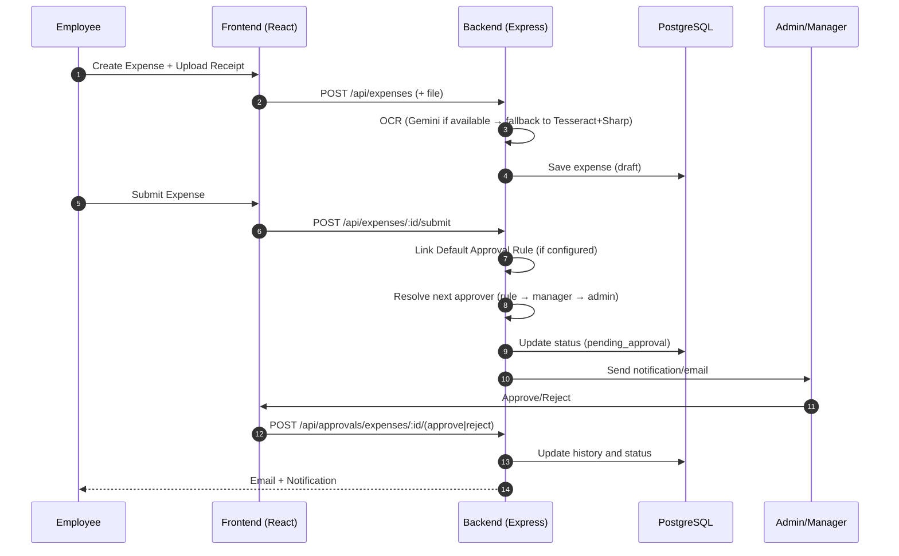

## 📖 Detailed Documentation

For comprehensive setup instructions, see [SETUP_GUIDE.md](SETUP_GUIDE.md)

## 🔑 Key API Endpoints

### Authentication
- `POST /api/auth/signup` - Create account and company
- `POST /api/auth/login` - User login
- `POST /api/auth/forgot-password` - Request password reset

### Expenses
- `GET /api/expenses` - List expenses (filtered by role)
- `POST /api/expenses` - Submit expense
- `POST /api/expenses/ocr` - Extract expense from receipt

### Approvals
- `GET /api/approvals/pending` - Get pending approvals
- `POST /api/approvals/expenses/:id/approve` - Approve expense
- `POST /api/approvals/expenses/:id/reject` - Reject expense

## 📸 Screenshots


> The same image is also featured on the landing page hero. Replace the file at `frontend/public/images/expe-dashboard.png` to update both.

### Gallery

Below are additional screenshots located in the `images/` directory:

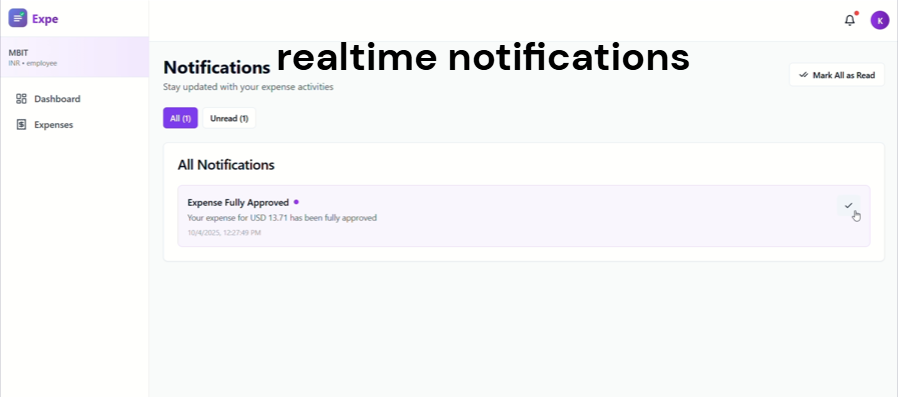
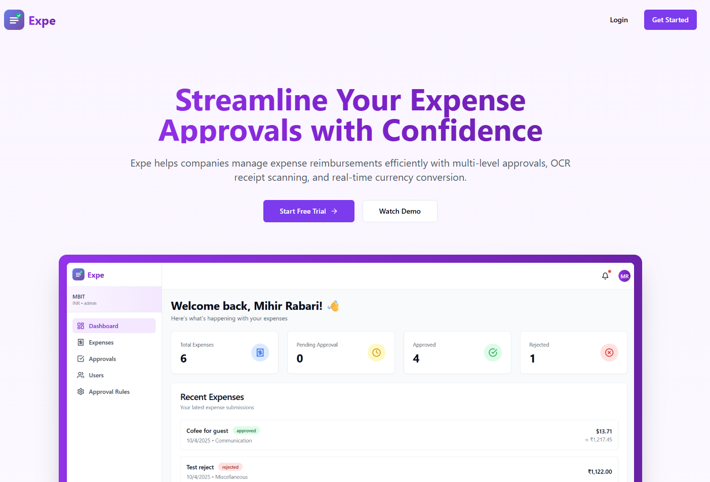
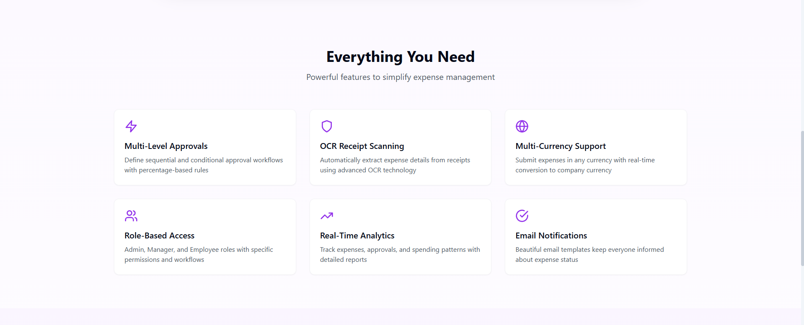
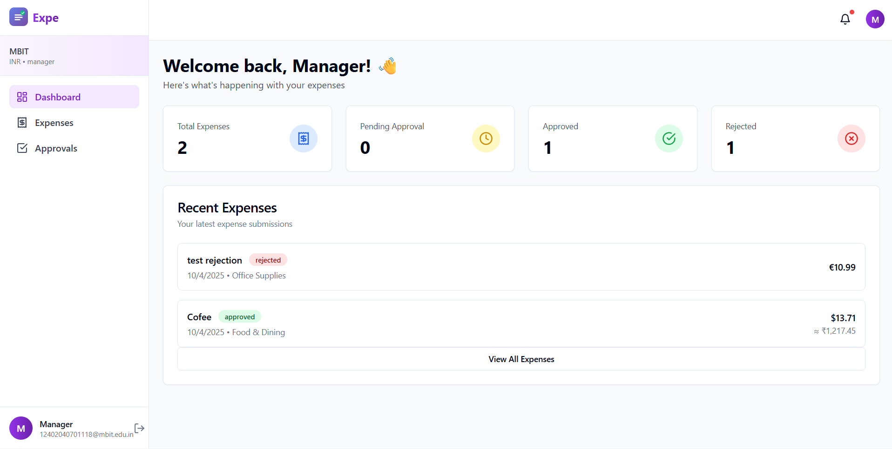
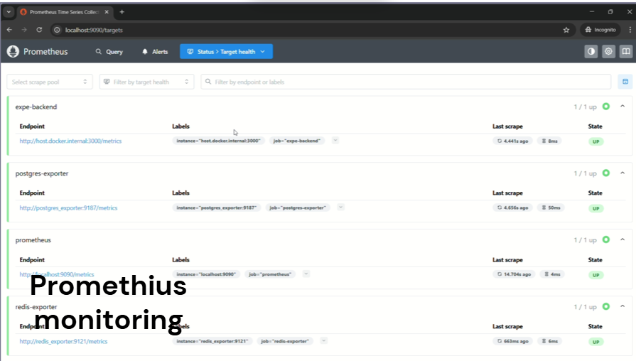
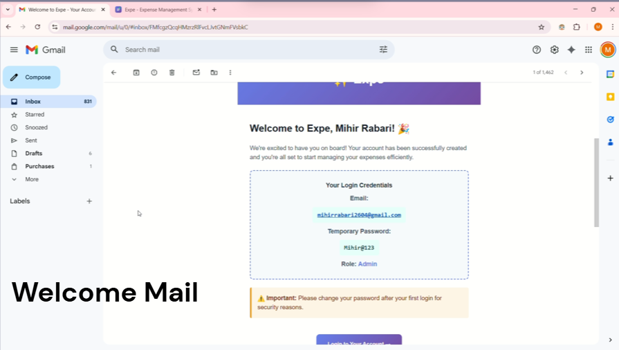
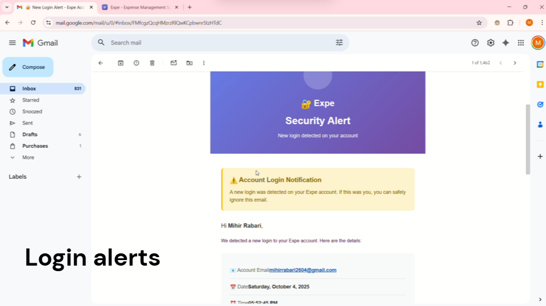
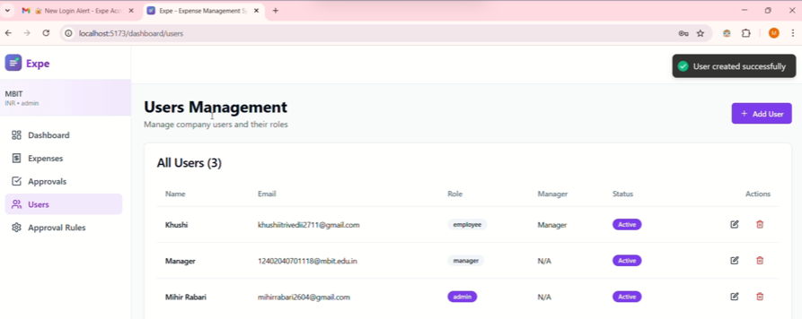
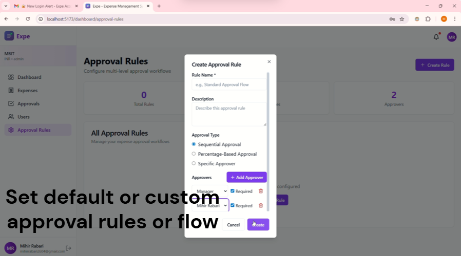

## 🎥 Demo Video

Watch the product walkthrough:
https://drive.google.com/file/d/1Vqli2c8zFLv9qGWJW90Xd-eaBPsHWp_l/view?usp=sharing

## 🤝 Contributing

Contributions are welcome! Please feel free to submit a Pull Request.

## 📄 License

MIT License - See LICENSE file for details

---

## ✨ Creator

Made with care by: **Mihir Rabari**

- LinkedIn: [Mihir Rabari](https://www.linkedin.com/in/mihir-rabari?utm_source=share&utm_campaign=share_via&utm_content=profile&utm_medium=android_app)
- GitHub: [Mihir-Rabari](https://github.com/Mihir-Rabari)
- Email: [mihirrabari2604@gmail.com](mailto:mihirrabari2604@gmail.com)
